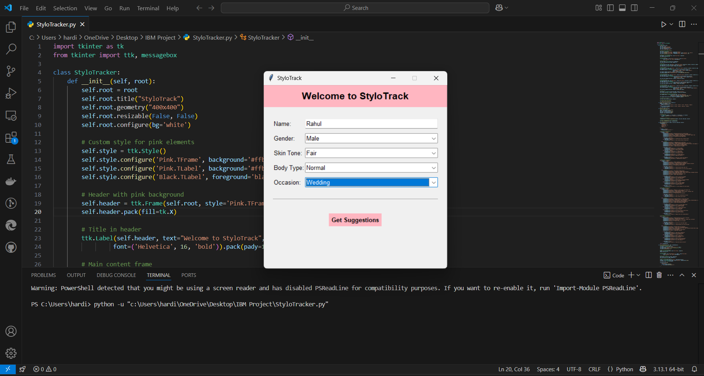
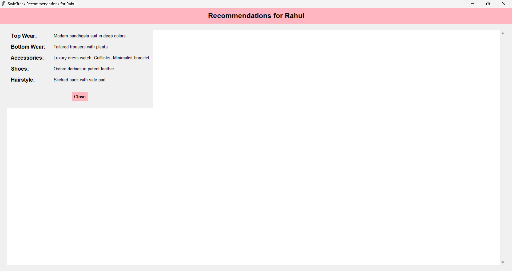
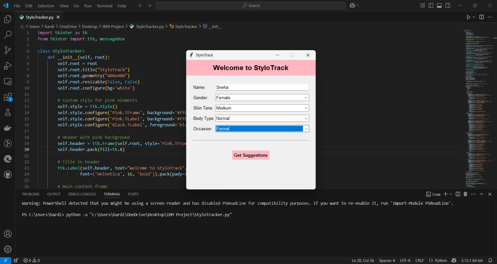
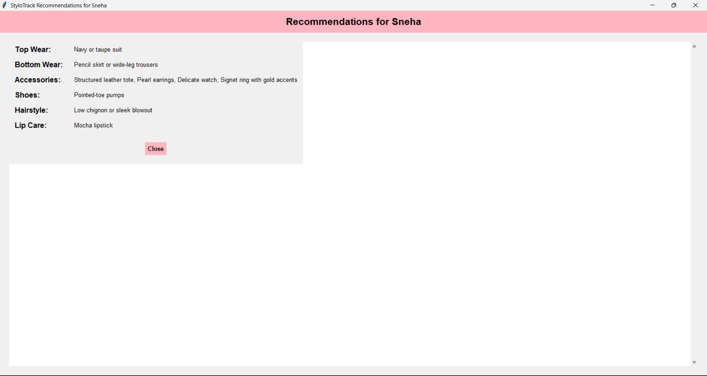

# StyloTrack

[](https://www.python.org/)
[]()
[](./LICENSE)

StyloTrack is a personalized fashion and skincare recommendation app built with Python and Tkinter. It offers curated outfit, accessory, hairstyle, and lip care suggestions based on user inputs like gender, skin tone, body type, and occasion.

## ✨ Features

- Intuitive GUI using Tkinter  
- Input form with dropdowns for gender, skin tone, body type, and occasion  
- Occasion-specific styling suggestions  
- Fullscreen scrollable output display  
- Gender-aware recommendations (including lip care for female users)

## 📸 Screenshot

> Add your screenshot as `screenshot.png` in the repo folder.






## 🚀 How to Run

1. Make sure you have Python 3 installed.
2. Install requirements:

```bash
pip install -r requirements.txt
```


---

### 📜 `LICENSE`

```text```

Custom Dual Attribution License

Copyright (c) 2025 
ragini9340 and ilmay04

Permission is hereby granted, free of charge, to any person obtaining a copy
of this software and associated documentation files (the "Software"), to use,
copy, modify, and distribute the Software, subject to the following conditions:

1. Proper credit must be given to both original contributors:
   - ragini9340 (https://github.com/ragini9340)
   - ilmay04 (https://github.com/ilmay04)

2. This license does not permit commercial redistribution without
   explicit permission from both contributors.

3. The above copyright notice and this permission notice
   shall be included in all copies or substantial portions of the Software.

THE SOFTWARE IS PROVIDED "AS IS", WITHOUT WARRANTY OF ANY KIND.
